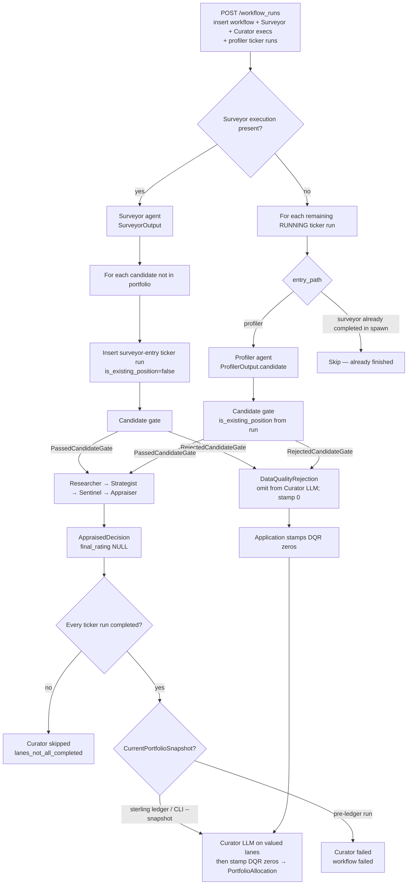

<!-- Synced: 2026-09-06 from live code via `.cursor/skills/sync-workflow` -->

# Discount Analyst — current workflow

Implementation-accurate snapshot of the agentic pipeline. Ground truth is the code. Field lists come from `model_json_schema()` / enum introspection unless a computed field is called out as class-only.

## Changes since last sync

Previous snapshot: 2026-09-05 (StrategistDecision object schema). This pass re-read ticker-lane orchestration, `derive_thesis_verdict`, Curator pack/finalise, decision persistence (`AppraisedDecision`), dashboard status flags, and Surveyor/Researcher/Strategist prompts.

**Curator weights are the live recommendation.** Sentinel and Appraiser are memos. New runs persist `decision_type=appraised` with `final_rating` NULL (Alembic `0017_appraised_decision_type`). Historical `rating_table` / `sentinel_rejection` JSON still loads for display.

**Sentinel skip deleted.** Every non-DQR lane always runs Appraiser (`ticker_lane_stage.py`, CLI `run_full_workflow.py`, mock). `sentinel_proceeds_to_valuation` is gone.

**No live allocation policy.** `allocation_policy_for`, packed `policy`/`rating`, and forced-zero / retain-or-reduce validators are deleted. Curator may size any valued lane (including 0% and adding to holdings). Keep the 15% company cap and sum/range invariants. DQR lanes are omitted from the LLM pack and stamped `[0,0,0]` afterwards; if every lane is DQR the LLM is not called (cash `[100,100,100]` plus zeros).

**`derive_thesis_verdict`:** `never_disclosed` is a soft gap like `calendar`. Unproven requires a printed (non-soft) set with Low share ≥ 50% **and** at least one Weakens/Breaks in the full list. Printed Weakens (`none`/`contradicted`) still WEAKENED. Labels do not skip Appraiser.

**Upstream prompts:** Strategist forbids unpublished cohort/ARR-style questions. Researcher helper failures go to `remaining_open_gaps`. Surveyor US screen uses `avgdailyvol3m`; do not pad an all-null 15.

**Operator status:** `GET /api/status` exposes `sec_user_agent_configured` and `companies_house_cache_present` (never the User-Agent string). Terminal sandbox includes `markitdown[pdf,docx]`.

**Unchanged:** Candidate data-quality gate existence, Surveyor exactly-15 schema, Appraiser valuation-only (no BUY/SELL), 15% company cap, dashboard sterling ledger, mock DEV-forced path.

Skill-table path drift (for the next operator): dashboard runner is `adapters/orchestration/sqlmodel_runner.py`, HTTP is `entrypoints/api/routers/workflow_runs.py`, CLI is `entrypoints/cli/workflows/run_full_workflow.py` plus `cli_curator.py`, builders are `application/decisions/builders.py`, live-thesis resolve is `application/theses.py`, lane order is `application/workflows/agent_lane_order.py`, rating enum is `domain/decisions/investment_rating.py` (historical only on new runs).

Checked and recorded below: schemas, agents, gates/orchestration, ratings (historical), tools/data. Prompt vs code conflicts are listed in [Findings](#findings-prompt-vs-code), not silently “corrected” in the narrative.

---

## Overview

Discount Analyst runs a **gated, per-ticker lane** after a universe-level Surveyor and/or named-ticker Profiler pass, then one **workflow-level Curator** once every ticker lane is terminal-success.

Two entry paths (`EntryPathDb` / `EntryPathApi`):

- **Profiler entry** — dashboard holdings and also-analyse names, or CLI `--profiler-tickers`. Runs Profiler first. Dashboard sets `is_existing_position=True` only for holdings (`value_gbp` set); also-analyse names are `False`.
- **Surveyor entry** — names discovered by Surveyor that are not already in the portfolio. No Profiler execution. Dashboard sets `is_existing_position=False`.

Shared downstream lane (both paths): **candidate gate → Researcher → Strategist → Sentinel → Appraiser**. After all lanes, **Curator** consumes packed valued-lane evidence plus a `CurrentPortfolioSnapshot`. DQR lanes skip Researcher→Appraiser and are stamped zero after Curator (or instead of the LLM if every lane is DQR).

Two runners share the same agent factories and decision builders:

1. **Dashboard** — `DashboardPipelineRunner.execute_workflow` persists SQLite rows, conversations, a per-ticker `AppraisedDecision` or DQR, and (when Curator completes) a normalised `PortfolioAllocation`. HTTP create is `POST` on the workflow-runs router.
2. **CLI** — `uv run discount-analyst workflow run --snapshot PATH` writes JSON artefacts under `backend/outputs/`. It does **not** run the FMP/EODHD candidate gate. Curator is skipped if any profiler/researcher/strategist/sentinel/appraiser failure was recorded.

Ticker lanes are **serial** in both runners (`await` in a `for` loop). There is no pipeline-level `asyncio.gather` of lanes. Parallelism exists only *inside* an agent turn; Surveyor performs bounded paging and shortlist enrichment inside terminal calls, then batches official verification calls in groups of at most five.

---

## Pipeline diagram

Dashboard control flow from `DashboardPipelineRunner.execute_workflow` (`sqlmodel_runner.py`) plus `SurveyorStage`, `ProfilerStage`, `CandidateGateStage`, `TickerLaneStage`, and `CuratorStage`.



CLI omits the candidate-gate diamond: Surveyor or Profiler output goes straight to `SurveyorCandidate.to_lane_context()` and the same Researcher→… path (`run_full_workflow.py`). Curator runs after the candidate loop unless a lane failure was recorded (`cli_curator.py`).

---

## Agent handoff table

| Stage          | Stance (from that agent’s system prompt)                                  | Input                                                                   | Output schema                                                                           | Tools                                                                                                                                                    |
| -------------- | ------------------------------------------------------------------------- | ----------------------------------------------------------------------- | --------------------------------------------------------------------------------------- | -------------------------------------------------------------------------------------------------------------------------------------------------------- |
| Surveyor       | Disciplined **screener** in neglected small-caps                          | Open mandate (`USER_PROMPT`); no ticker                                 | `SurveyorOutput` (exactly 15 candidates)                                                | Web research + financial MCP + required terminal + official universe lists + official filings                                                            |
| Profiler       | Financial screener of a **named** stock; resist favourable framing        | Ticker string                                                           | `ProfilerOutput` wrapping one `SurveyorCandidate`                                       | Same as Surveyor except no universe listing tools (filings only)                                                                                         |
| Candidate gate | Deterministic, not an LLM                                                 | `SurveyorCandidate`                                                     | `PassedCandidateGate` / `RejectedCandidateGate`                                         | FMP (+ EODHD fallback for `.L`). Identity-unknown and listing-unconfirmed **admit**. DQR is **delist-only**. **Skipped in mock.** **Not used by CLI.**   |
| Researcher     | **Neutral evidence assembler**; no recommendation language                | `SurveyorLaneContext`                                                   | `DeepResearchReport`                                                                    | Web research + financial MCP + optional terminal + official filings                                                                                      |
| Strategist     | **Second-level thinker**; interpreter not researcher                      | Lane context + `DeepResearchReport` + optional prior `MispricingThesis` | `StrategistDecision` (`keep_prior` \| `replace`); live thesis via `resolve_live_thesis` | Web research + financial MCP + optional terminal + official filings. Prompt forbids expanding research; tools may only confirm or falsify packed claims. |
| Sentinel       | **Adversary, not a validator**                                            | Lane context + research + **live** thesis                               | `EvaluationReport` (`thesis_verdict` is a label)                                        | FX (`convert_currency`) + official filings. No web, MCP, or terminal. `thesis_verdict` overwritten in Python after a live run.                           |
| Appraiser      | Valuation specialist; **no Buy/Hold/Sell**                                | `AppraiserInput`                                                        | `AppraiserOutput` then persist `AppraisedDecision`                                      | Web research + financial MCP + optional terminal + official filings                                                                                      |
| Curator        | Closed-book **portfolio constructor**; weights **are** the recommendation | `CuratorInput` (snapshot + valued lanes + `live_thesis`)                | `CuratorProposal` then `PortfolioAllocation`                                            | FX attached by factory but **must not be called**. Web/terminal allowed; no Perplexity, MCP, or filings.                                                 |

Shared investing creed: `discount_analyst.agents.common_prompts.creed.INVESTING_CREED` (prepended or wrapped by every agent system prompt).

Structured output is always pydantic-ai **tool mode** (`ToolOutput` → `final_result`) via `create_agent` in `agents/runtime/agent_factory.py`.

---

## Ratings (historical only)

Enum `InvestmentRating` (`domain/decisions/investment_rating.py`) still exists for **stored historical rows**:

| Member        | Value         |
| ------------- | ------------- |
| `STRONG_BUY`  | `STRONG BUY`  |
| `BUY`         | `BUY`         |
| `HOLD`        | `HOLD`        |
| `SELL`        | `SELL`        |
| `STRONG_SELL` | `STRONG SELL` |

Persisted `decision_type` (`DecisionTypeDb` / `DecisionTypeApi`): `appraised` \| `data_quality_rejection` \| `rating_table` \| `sentinel_rejection`. New runs emit `appraised` or `data_quality_rejection` only. Reconstruct still parses historical `rating_table` / `sentinel_rejection` JSON.

### `is_existing_position`

Threaded from the ticker run: dashboard holdings (`value_gbp` set) are true; also-analyse Profiler names and Surveyor-discovered names are false. CLI uses `--is-existing-position`. `_profiler_entry_pipeline` must pass the run flag — not assume Profiler means existing.

On the **live** path the flag frames DQR `recommended_action` wording and Sentinel prompt wording, and Curator `action` is derived from current weight vs the proposed band (`derive_rebalance_action`). It does **not** select an allocation policy kind (those kinds are gone). Historical Sentinel/rating-table JSON still used the flag for action text.

### Sentinel thesis labels (not a skip)

After a **live** Sentinel run, `finalise_sentinel_evaluation(evaluation, thesis)` in `agents/sentinel/derive_thesis_verdict.py` (1) rejects a question-count mismatch with `SentinelQuestionCountError` (lane fails; nothing is persisted) and (2) overwrites `thesis_verdict` from `question_assessments` / `gap_kind`. The model’s submitted `thesis_verdict` is best-effort only. Reconstruct-from-DB and mock Sentinel do **not** re-run this.

Derivation order:

1. Any **Breaks thesis** at Medium/High → `BROKEN_DO_NOT_PROCEED`.
2. Any **Weakens thesis** with `gap_kind` in `{none, contradicted}` → `WEAKENED_DO_NOT_PROCEED`.
3. Unproven: consider only assessments whose `gap_kind` is **not** `{calendar, never_disclosed}`. Fire `UNPROVEN_DO_NOT_PROCEED` only if that printed set is non-empty, Low share ≥ 50%, **and** there is at least one Weakens or Breaks in the **full** list.
4. Any `calendar` or `never_disclosed` → `INTACT_WITH_RESERVATIONS`.
5. Else intact.

`never_disclosed` is a reservation, not a one-strike kill. Zero Weakens/Breaks with a Low majority must **not** become Unproven.

Appraiser **always** runs after Sentinel on non-DQR lanes. Weakened/unproven/broken strings remain evidence labels in the Appraiser user prompt and the Curator pack (`CompactSentinelEvidence.thesis_verdict`).

### Margin of safety (from Appraiser distribution)

`MarginOfSafetyAssessment.from_distribution` uses `current_share_price`, `expected_intrinsic_value`, `p10`, `p90`. Packed into Curator as `CompactAppraiserEvidence`; not mapped to a live BUY/SELL.

`margin_of_safety_base_pct = (expected − price) / price × 100`, then:

| Bucket                                                                  | Condition |
| ----------------------------------------------------------------------- | --------- |
| Substantial — price implies significant downside in market expectations | `>= 40`   |
| Moderate — meaningful upside but not exceptional                        | `>= 20`   |
| Thin — limited margin for error                                         | `> 0`     |
| None — stock appears fairly valued or overvalued                        | otherwise |

Computed serialisation aliases on the class (not LLM fields): `intrinsic_value_base` / `_bear` / `_bull`, `margin_of_safety_base_pct`, `margin_of_safety_verdict`.

### Historical rating table (`rating_from_table_inputs`, `decision_rule_id="rating_table_v1"`)

Kept for reconstruct of old `Verdict` JSON. **Not** written on new runs. Match on `(MoS bucket, Strategist conviction, sentinel_has_reservations)`:

| MoS         | Conviction            | Reservations | Rating       |
| ----------- | --------------------- | ------------ | ------------ |
| Substantial | High                  | false        | `STRONG BUY` |
| Substantial | any other combination |              | `BUY`        |
| Moderate    | High or Medium        | ignored      | `BUY`        |
| Moderate    | Low                   | ignored      | `HOLD`       |
| Thin        | ignored               | ignored      | `HOLD`       |
| None        | ignored               | ignored      | `SELL`       |

The table **never** emits `STRONG SELL`. That rating only appears on historical Sentinel rejection (broken thesis or serious red flag).

---

## Complete schema reference

Introspected 2026-08-30 via `model_json_schema()` / enum values. Nested models are listed once. `required` means the JSON schema `required` array (Pydantic defaults may still appear on the wire).

### Enums

| Enum                     | Values                                                                                                                                                                                                                                                         |
| ------------------------ | -------------------------------------------------------------------------------------------------------------------------------------------------------------------------------------------------------------------------------------------------------------- |
| `Exchange`               | `LSE`, `AIM`, `NYSE`, `NASDAQ`                                                                                                                                                                                                                                 |
| `Currency`               | `GBP`, `USD`                                                                                                                                                                                                                                                   |
| `StockCategory`          | `value`, `growth` — **defined in `surveyor.schema` but unused** (no field on `SurveyorCandidate`)                                                                                                                                                              |
| `ThesisVerdict`          | `Thesis intact — proceed to valuation`, `Thesis intact with reservations — proceed with noted caveats`, `Thesis weakened — do not proceed`, `Thesis unproven — do not proceed`, `Thesis broken — do not proceed`                                               |
| `OverallRedFlagVerdict`  | `Clear`, `Monitor`, `Serious concern`                                                                                                                                                                                                                          |
| `ValuationMethod`        | `dcf`, `reverse_dcf`, `comparable_multiples`, `sum_of_parts`, `asset_value`, `unit_economics`, `scenario_weighting`, `monte_carlo`, `earnings_multiple`, `fcf_yield` (no `other`)                                                                              |
| `InvestmentRating`       | see [Rating system](#rating-system)                                                                                                                                                                                                                            |
| `RebalanceAction`        | `enter`, `increase`, `hold`, `reduce`, `exit`, `avoid` (`domain/allocations/actions.py`)                                                                                                                                                                       |
| `AgentName` (runtime)    | `CURATOR`, `APPRAISER`, `PROFILER`, `RESEARCHER`, `SENTINEL`, `STRATEGIST`, `SURVEYOR`                                                                                                                                                                         |
| `AgentNameDb` / API slug | lowercase: `surveyor`, `profiler`, `researcher`, `strategist`, `sentinel`, `appraiser`, `curator`                                                                                                                                                              |
| `ModelName`              | `claude-opus-4-5`, `claude-sonnet-4-5`, `claude-opus-4-6`, `claude-sonnet-4-6`, `claude-haiku-4-6`, `gpt-5.1`, `gpt-5.2`, `gpt-5.4`, `gpt-5.6-luna`, `gpt-5.6-terra`, `gemini-3-pro-preview`, `gemini-3.1-pro-preview`, `deepseek-v4-flash`, `deepseek-v4-pro` |

### `KeyMetrics`

All fields optional (`null` allowed). `piotroski_f_score`: integer 0–9 or null.

`trailing_pe`, `ev_ebit`, `price_to_book`, `revenue_growth_3y_cagr_pct`, `free_cash_flow_yield_pct`, `net_debt_to_ebitda`, `piotroski_f_score`, `altman_z_score`, `insider_buying_last_6m`.

### `SurveyorCandidate` (required unless noted)

`ticker`, `company_name`, `exchange`, `currency`, `market_cap_local` (int), `market_cap_display`, `sector`, `industry`, `key_metrics`, `rationale`, `red_flags`, `data_gaps`. Optional: `analyst_coverage_count` (int \| null).

`to_lane_context(resolved_ticker=…)` drops `market_cap_*` and `key_metrics`.

### `SurveyorLaneContext` (all required)

`ticker`, `company_name`, `exchange`, `currency`, `sector`, `industry`, `analyst_coverage_count` (int \| null), `rationale`, `red_flags`, `data_gaps`.

### `SurveyorOutput`

`candidates`: array of `SurveyorCandidate`, **`minItems`: 15**, **`maxItems`: 15**, unique tickers (validator).

### `ProfilerOutput`

`candidate`: `SurveyorCandidate` (required).

### `DeepResearchReport` (all required)

| Field                   | Type                                                                                                                                                                                                                 |
| ----------------------- | -------------------------------------------------------------------------------------------------------------------------------------------------------------------------------------------------------------------- |
| `executive_overview`    | string                                                                                                                                                                                                               |
| `business_model`        | `BusinessModel`: `products_and_services`, `customer_segments`, `unit_economics`, `competitive_positioning`, `moat_and_durability`                                                                                    |
| `financial_profile`     | `FinancialProfile`: `key_metrics_updated` (`KeyMetrics`), `revenue_and_growth_quality`, `profitability_and_margin_structure`, `balance_sheet_and_liquidity`, `cash_flow_and_capital_intensity`, `capital_allocation` |
| `management_assessment` | `ManagementAssessment`: `leadership_and_execution`, `governance_and_alignment`, `communication_quality`, `key_concerns`                                                                                              |
| `market_narrative`      | `MarketNarrative`: `dominant_narrative`, `bull_case_in_market`, `bear_case_in_market`, `expectations_implied_by_price`, `where_expectations_may_be_wrong`, `narrative_monitoring_signals` (string[])                 |
| `risks`                 | string[]                                                                                                                                                                                                             |
| `potential_catalysts`   | string[]                                                                                                                                                                                                             |
| `data_gaps_update`      | `DataGapsUpdate`: `original_data_gaps`, `closed_gaps`, `remaining_open_gaps`, `material_open_gaps`                                                                                                                   |
| `source_notes`          | string[]                                                                                                                                                                                                             |

No `minItems` on the lists.

### `MispricingThesis` (all required)

`ticker`, `company_name`, `mispricing_type`, `market_belief`, `mispricing_argument`, `resolution_mechanism`, `falsification_conditions` (string[]), `thesis_risks` (string[]), `evaluation_questions` (string[]), `permanent_loss_scenarios` (string[]), `conviction_level` (`Low` \| `Medium` \| `High`).

`evaluation_questions` description: each question must be answerable from the last reported period plus the last trading update; a future print (e.g. “what will FY26 report?”) must not be load-bearing. Descriptions say “minimum 3 / 5 / 2” for some lists; **JSON schema has no `minItems`** on those arrays.

### `StrategistDecision` (single object, `decision` required)

Factory `output_type` (`agents/strategist/schema.py`, `BaseModel` `StrategistDecision`). JSON schema `type` is `object` (`additionalProperties: false`).

| Field      | Constraint                                                                                            |
| ---------- | ----------------------------------------------------------------------------------------------------- |
| `decision` | required enum `keep_prior` \| `replace`                                                               |
| `thesis`   | optional `MispricingThesis` or null. Keep forbids a nested thesis; replace requires one (validators). |

Keep dump omits `thesis` (`{"decision":"keep_prior"}`). Replace dump includes the nested thesis. `KeepPriorThesis` / `ReplaceThesis` no longer exist.

Keep with no prior is a lane failure (`KeepPriorWithoutThesisError` from `application/theses.resolve_live_thesis`). Keep copies the prior object bit-for-bit; the model must not echo thesis fields. Conversation reconstruction still yields a `MispricingThesis` because keep copies the prior into this execution’s `mispricing_theses` tables.

`PackedMispricingThesis` in `agents/curator/schema.py` is field-identical to `MispricingThesis` so Curator does not import the Strategist package.

### `EvaluationReport` (all required)

`ticker`, `company_name`, `question_assessments` (`QuestionAssessment`[]), `red_flag_screen` (`RedFlagScreen`), `thesis_verdict`, `verdict_rationale`, `material_data_gaps`, `caveats` (string[]).

`QuestionAssessment`: `question`, `evidence`, `verdict` (`Supports thesis` \| `Neutral` \| `Weakens thesis` \| `Breaks thesis`), `confidence` (`Low` \| `Medium` \| `High`), `gap_kind` (`none` \| `calendar` \| `never_disclosed` \| `contradicted`).

`RedFlagScreen`: `governance_concerns`, `balance_sheet_stress`, `customer_or_supplier_concentration`, `accounting_quality`, `related_party_transactions`, `litigation_or_regulatory_risk`, `overall_red_flag_verdict`.

No persisted `recommendation` field. The model fills `thesis_verdict` best-effort; live runners overwrite it via `finalise_sentinel_evaluation` before persist. The string is a label for Appraiser and Curator, not a skip.

### `AppraiserInput` (all required)

`lane_context`, `deep_research`, `thesis`, `evaluation`, `risk_free_rate_pct` (float; caller-supplied).

### `IntrinsicValueDistribution` (all required)

Defined in `domain/valuation/intrinsic_value_distribution.py`; imported by `AppraiserOutput`.

`currency` (string length 3–8), `current_share_price` (>0), `expected_intrinsic_value` (>0), `p10`/`p25`/`p50`/`p75`/`p90_intrinsic_value` (>0), `distribution_method`, `distribution_reasoning`.

Class validator: percentiles monotonic; expected between p10 and p90.

### `ValuationMethodResult`

Required: `method`, `role` (`primary` \| `cross_check`), `value_per_share` (`gt=0`), `weight_pct` (`0–100`). Optional: `low_value_per_share`, `high_value_per_share` (both `gt=0` or null). Default empty lists: `key_assumptions`, `evidence_summary`, `sanity_checks`, `limitations`.

Low ≤ high when both present.

### `AppraiserOutput`

Required: `ticker`, `company_name`, `valuation_date`, `summary`, `valuation_distribution`, `methods`, `data_quality` (`High` \| `Medium` \| `Low`), `shares_outstanding` (`gt=0`), `share_count_source` (`filing` \| `profile` \| `implied_from_market_cap`), `quoted_price_unit` (`major` \| `subunit`).

Default empty lists: `key_value_drivers`, `downside_risks_to_value`, `upside_drivers_to_value`, `caveats`.

Class validator: ≥1 method; **exactly one** `primary`; **≥1** `cross_check`; weights sum to **100 ± 0.05**; `expected_intrinsic_value` equals the weight-blend of method `value_per_share` values within `max(0.01, 0.5% of |blend|)`. Distribution percentiles remain a separate monotonic / expected-in-[p10, p90] check.

### Gate result models

`PassedCandidateGate`: `gate_status="passed"`, `source_ticker`, `resolved_ticker`, `resolution_notes`, `is_actively_trading` (`True` means **not proven delisted**, including unconfirmed listing), `data_source` (`fmp` \| `eodhd` \| `mock`), `lane_context`.

`RejectedCandidateGate`: `gate_status="rejected"`, `source_ticker`, `resolved_ticker` (nullable), `resolution_notes`, `gate_failure_reason`, `is_actively_trading` (nullable), `data_source`.

### Decision models

`AppraisedDecision`: `decision_kind="appraised"` plus ticker/company/date/`is_existing_position` only. No rating.

`DataQualityRejection`: identity + `recommended_action` + `rejection_reason`. No rating on new rows.

`SentinelRejection` / `RatingTableDecision` / `Verdict`: **historical** reconstruct only. `Verdict.rating` and `recommended_action` are optional.

`RatingTableRationale`: required `primary_driver`, `red_flag_disposition`, `data_gap_disposition`; `supporting_factors` / `mitigating_factors` default `[]`.

`MarginOfSafetyAssessment` input fields: `current_price`, `expected_intrinsic_value` (aliases `intrinsic_value_base` / `base_intrinsic_value`), `p10_intrinsic_value`, `p90_intrinsic_value` (all >0).

### Allocation contracts (`domain/allocations/` + `agents/curator/schema.py`)

Constants: `WEIGHT_SUM_TOLERANCE_PP = 0.05`, `COMPANY_WEIGHT_CAP_PCT = 15.0`.

`CurrentPositionWeight`: `ticker`, `current_weight_pct` (0–100).

`CurrentPortfolioSnapshot`: `as_of` (date), `positions`, `cash_weight_pct` (0–100). Validator: case-insensitive unique tickers; positions + cash total 100 ± 0.05 pp. Dashboard builds this from `SterlingPortfolioLedger` (`positions` of ticker + `value_gbp` ≥ 0, `cash_gbp` ≥ 0) via `snapshot_from_sterling_ledger`. Zero total → empty positions and 100% cash. Otherwise each holding is `round(100 * value / total, 2)` with remainder on cash (or on the last holding when cash is 0). CLI still ingests `CurrentPortfolioSnapshot` JSON.

`AllocationPolicy` is **deleted**. Reconstruct of old allocation JSON ignores a `policy` key if present.

`CompactResearcherEvidence`: `customer_segments`, `risks` (string[]).

`CompactStrategistEvidence`: `thesis_summary`, `conviction` (`Low` \| `Medium` \| `High`), `thesis_risks`, `permanent_loss_scenarios`.

`CompactSentinelEvidence`: `customer_or_supplier_concentration`, `red_flag_verdict` (`Clear` \| `Monitor` \| `Serious concern`), `thesis_verdict`, `material_data_gaps`.

`CompactAppraiserEvidence`: `current_price`, `expected_value`, `p10`, `p90`, `margin_of_safety_base_pct`, `data_quality` (`High` \| `Medium` \| `Low`).

`CuratorLaneIdentity`: `ticker`, `company_name`, `is_existing_position`, `current_weight_pct` (0–100), `sector`, `industry`. No `policy` or `rating`.

`PackedMispricingThesis`: same fields as `MispricingThesis` (see above). Compact `strategist` evidence is derived from that object so ranking cues cannot drift.

Live packed lane is `AppraisedLaneEvidence` with required `live_thesis`, `researcher`, `strategist`, `sentinel`, `appraiser`. DQR is **not** packed; it is stamped after finalise.

`CuratorInput`: `allocation_date`, `snapshot`, `lanes` (valued only). Validator: case-insensitive unique lane tickers.

`ProposedPosition`: `ticker`, `target_weight_pct`, `acceptable_weight_low_pct`, `acceptable_weight_high_pct` (all 0–100), `rationale`.

`ProposedCash`: same weight fields + `rationale`.

`ProposedSharedRiskCluster`: `label`, `member_tickers` (string[]), `mechanism`, `allocation_effect`. Validator on the proposal: unique labels; each cluster ≥ 2 unique members.

`CuratorProposal`: `allocation_date`, `positions`, `cash`, `shared_risk_clusters`, `portfolio_rationale`. Validators: unique tickers, ordered low ≤ target ≤ high, equity+cash targets 100 ± 0.05 pp (same for range lows/highs).

`AllocationPosition` (final): proposed weights plus `company_name`, `source_run_id`, `is_existing_position`, `current_weight_pct`, `action` (`enter` \| `increase` \| `hold` \| `reduce` \| `exit` \| `avoid`). No `policy`.

`CashAllocation`: current + target + range + `rationale`.

`SharedRiskCluster`: `label`, `member_tickers`, `mechanism`, `allocation_effect`.

`PortfolioAllocation`: `allocation_date`, `positions`, `cash`, `shared_risk_clusters`, `portfolio_rationale`. Extra validators: unique tickers; company cap 15% by casefolded `company_name`; no forced-zero / retain-or-reduce checks.

---

## Per-stage notes

### Workflow create (dashboard)

`create_workflow_run` in `entrypoints/api/routers/workflow_runs.py`:

- Inserts `workflow_runs` with `cash_gbp` (always set on new launches, including `0.00`) and `is_mock`. Holding rows store `value_gbp`; also-analyse rows store `value_gbp` NULL.
- **If `settings.deploy_env == "DEV"`, `is_mock` is forced `True`**, ignoring the request body.
- Always inserts a workflow-level Surveyor execution (`surveyor_started=True`) **and** a pending workflow-level Curator execution (`insert_workflow_run`).
- Each holding becomes a profiler-entry run with `PROFILER_ENTRY_AGENT_NAMES` and `is_existing_position=True`. Remaining suggestion tickers get the same agent list with `is_existing_position=False`. Blank tickers, negatives, and casefold duplicates 422 (overlap between a holding and a pill drops the pill).
- Schedules `DashboardPipelineRunner.schedule_workflow_execution`.

Also: cancel (covers workflow-scoped Surveyor and Curator plus unfinished lanes); `retry_failed_agents` (resets failed or cancelled lane executions from the first unfinished agent onward; resets Curator whenever Surveyor or a lane is reset, except a legacy skipped Curator; Curator-only retry when lanes stay completed and Curator is failed/cancelled; then re-enters `execute_workflow`; completed stages and completed lanes are skipped by status checks).

### Surveyor

Factory: `create_surveyor_agent` → `SurveyorOutput`. Bound schema matches the prompt’s `<output_schema>` embed of `SurveyorOutput.model_json_schema()`.

Hard filters in the prompt: market cap below £500M / $600M; LSE/AIM/NYSE/NASDAQ; liquidity; SEC or UK filings; ≥3 years history. Soft ranking signals for coverage gap, value, growth, earnings quality, balance sheet.

Prompt execution path: no more than three bounded `terminal_exec` calls use yfinance `EquityQuery` / `screen` for US and UK discovery and enrichment. US filters market cap server-side and a valid trading field such as `avgdailyvol3m`; if the US screen fails, retry once without the volume operand. UK pages the LSE result and filters `marketCap` locally because the Yahoo UK server-side cap filter is unreliable. The agent enriches at most 30 names per market, reconciles price × shares, applies explicit traded-value and operating-history filters, then uses official listing and filing tools on exactly 15 provisional finalists and no more than two replacements. Do not emit a candidate unless Step 2 hard filters actually ran. UK `.L` suffixes are stripped before exact TIDM lookups. Web gap-fill is capped at four searches so the complete path remains within the 60-tool-call limit. FMP/EODHD screeners are forbidden. Documents/PDFs via Python `markitdown`; do not call `curl`/`wget`/`pdftotext`.

Dashboard: Surveyor discoveries whose ticker is already in the portfolio (casefold) are **not** spawned. Spawned lanes run **immediately** inside `SurveyorStage.run` via `spawn_surveyor_discovered_run`, then `execute_workflow` walks remaining RUNNING runs (profiler entries).

Mock: `mock_surveyor_dashboard_discoveries(..., limit=3)` — three names, so **mock output would not satisfy `minItems: 15`** if it went through `SurveyorOutput` validation; the dashboard mock path uses the helper’s candidate list, not a validated 15-row `SurveyorOutput`.

### Profiler

Factory: `create_profiler_agent` with `enable_web_research_tools=True`. Output is one `SurveyorCandidate` (same shape as a Surveyor row). Company name is written back onto the ticker run. Filing tools are attached; universe listing tools are not.

Prompt source order: yfinance for a dated market snapshot; SEC/Companies House and issuer documents for statement facts; web search for insiders, coverage and red flags; optional paid non-screening data only as a one-attempt gap-fill. `market_cap_local` is stored in the declared major currency, so `.L` GBp fast-info values are converted to GBP exactly once. The prompt explicitly notes that Profiler has no universe-listing tools.

### Candidate gate

`validate_candidate` (`adapters/market_data/candidate_gates.py`):

1. **Ticker resolution** via FMP profile then symbol search (`_resolve_ticker` / `_resolve_via_search`). Auto-correct only when FMP is confident: profile company-name similarity ≥ 0.55, or search exact `symbol` + exchange match, or exactly one strong name match (≥ 0.75) on the candidate’s exchange (exchange aliases in `_EXCHANGE_FMP_ALIASES`). Unknown or ambiguous identity — empty search, weak name hits, several strong matches, FMP 402/403 on profile or search — **admits the original ticker** (`resolved_ticker == source_ticker`); `resolution_notes` records why identity was left unchanged. Identity never returns `RejectedCandidateGate`.
2. **Listing probe** (`_check_listing_status` / `_check_listing_via_eodhd`). Reject only on **positive** dead-listing evidence:
   - Non-`.L`: FMP `isActivelyTrading is false` (no EODHD override).
   - `.L`: FMP inactive/missing/denied still falls through to EODHD unless `eodhd.disabled`; reject only if EODHD `IsDelisted is true`.
   Unconfirmed listing **admits**: no FMP profile, `isActivelyTrading` unknown, FMP listing probe 402/403, EODHD missing quote **and** missing fundamentals, EODHD `close` NA/None but not delisted, EODHD HTTP 403/5xx or `httpx` transport errors on the listing probe (caught at the gate; client 404 already returns `None` without raising). Notes must say listing was unconfirmed. `is_actively_trading` is `True` meaning not proven delisted.

Pass: `lane_context` with `resolved_ticker`; ticker run updated if the symbol changed (`CandidateGateStage._apply_resolved_ticker`). Fail: skip Researcher–Appraiser; persist `DataQualityRejection` (delist-only). `validate_candidate` is the only composer of `PassedCandidateGate` / `RejectedCandidateGate` (from `TickerResolution` plus `ListingProbe` or `ListingDelisted`). `is_actively_trading` is set at compose time (`True` on pass, `False` on reject).

Mock: always `PassedCandidateGate` with notes `"Mock run: gate skipped."`

CLI: **no gate** (`run_full_workflow.py` uses `SurveyorCandidate.to_lane_context()` directly).

### Researcher / Strategist / Sentinel

Serial. User prompts inject `<SurveyorLaneContext>` plus the quantitative-omission note (`lane_context_prompt.py`): screening metrics are not trusted numbers. Researcher does **not** receive a prior thesis.

Dashboard `TickerLaneStage._run_strategist` loads `get_latest_investment_thesis_for_ticker` (casefold) and injects `<prior_mispricing_thesis>` when present. `keep_prior` is forbidden with no prior. After Strategist, `resolve_live_thesis` yields the in-run `MispricingThesis` passed to Sentinel and Appraiser. Persist stores `StrategistDecision` JSON then copies replace/keep into execution-scoped `mispricing_theses` (`persist_strategist_decision`). Resume reconstructs that copied `MispricingThesis` via `assistant_response_for_run_agent`, not the keep/replace wrapper.

Lookup order (`workflow_investment_theses.get_latest_investment_thesis_for_ticker`): newest **completed** workflow with a snapshot row for the ticker; else newest completed workflow whose Curator allocation chose the ticker (`target_weight_pct > 0`) and that lane’s Strategist row. Failed/cancelled workflows never become latest. CLI `workflow run` passes `prior_thesis=None`. One-shot: `uv run discount-analyst agent strategist --prior-thesis PATH`.

Researcher and Appraiser get Perplexity/MCP/terminal flags from settings. Strategist factory still forwards those same flags (`use_mcp_financial_data=True` default; `enable_web_research_tools` left at `create_agent` default `True`). Sentinel has no web/MCP/terminal: `create_sentinel_agent(ai_cfg)` only; live path uses `run_streamed_agent` with terminal disabled, then `finalise_sentinel_evaluation` before persist. Official filing tools are attached for all of these stages. Dashboard `is_existing_position` is passed into the Sentinel user prompt. Sentinel/Appraiser prompts name the injected object the **live** thesis.

Researcher prompt order is yfinance market snapshot → official filings and issuer documents → targeted narrative research → optional paid gap-fill. Sentinel normally evaluates packed evidence without a tool call; it may make one SEC call or one UK resolve/accounts chain for a load-bearing fact, and cannot claim to refresh market data.

### Appraiser

`AppraiserInput` is built in `TickerLaneStage.run_appraiser` with `risk_free_rate_pct=host.settings.risk_free_rate_pct` (dashboard default 3.7, env `DASHBOARD_RISK_FREE_RATE`; CLI requires `--risk-free-rate`).

DCF is **a valid method, not a required stage**. Optional Python helpers live under `discount_analyst/domain/valuation/toolkit/` (`dcf.py`, `reverse_dcf.py`, `multiples.py`, …) and `domain/valuation/schema.py` (`StockData`, `StockAssumptions`). The Appraiser user prompt says **do not** return those DCF-specific objects. There is no separate deterministic DCF engine invoked by the runner; arithmetic is LLM + optional terminal.

Before modelling, the Appraiser prompt requires an auditable data cut: dated quote and unit, market capitalisation, share count, price × shares reconciliation, and filing-period provenance. `.L` GBp values are converted to major GBP exactly once. Terminal arithmetic must recompute the method-weight blend before `final_result`.

On Appraiser success the runner persists `AppraisedDecision` (`decision_type=appraised`, `final_rating` NULL). It does **not** call a rating table.

If Appraiser execution id is missing, `run_appraiser` **returns without a completion** (`if appraiser_exec_id is None: return`). DQR is the only intended skip of Appraiser.

### Curator

Factory: `create_curator_agent` → `CuratorProposal`. Web search/fetch on (factory default); no Perplexity; no MCP; terminal follows `settings.use_terminal` via `run_agent_with_terminal`. `REGULATORY_TOOLSETS_BY_ROLE[CURATOR]` is empty. Frankfurter is still attached; the prompt forbids calling it. Packed `CuratorInput` is valued lanes only; **weights are the recommendation**.

Dashboard: `CuratorStage.run` after the ticker loop in `execute_workflow`. Skip if already `completed` or `skipped`. If any ticker run is not `completed`, mark Curator `skipped` with `lanes_not_all_completed`. If every completed lane is DQR, skip the LLM and `synthesise_cash_only_allocation`. `load_dashboard_portfolio_snapshot` converts the run’s sterling ledger (`as_of` = UTC date of `workflow_runs.started_at`) for both mock and live. Pre-ledger rows (`cash_gbp IS NULL`) raise `RuntimeError`. Empty ledger is 100% cash. Mock then uses `mock_curator_proposal` after a 5s sleep. Snapshot `as_of` is launch date; `allocation_date` remains `date.today()`.

Application packing (`assemble_curator_job`) maps Researcher/Strategist/Sentinel/Appraiser schemas into compact valued-lane evidence so the Curator package does not import those stages. Every packed lane carries `live_thesis` (`PackedMispricingThesis`); compact Strategist evidence is derived from that object. DQR lanes are omitted from the LLM pack **and** from the packed snapshot (their current weight is folded into cash). They are stamped `[0,0,0]` after finalise from the true ledger. The Curator prompt ranks using `live_thesis` and must not invent or edit theses. `finalise_curator_proposal` stamps current weights, company names, `source_run_id`, and `action`; invalid numbers fail the workflow. In-flight historical `rating_table` lanes pack as valued; `sentinel_rejection` lanes stamp like DQR.

Persist: normalised `portfolio_allocations*` tables plus conversation (`persist_completed_curator_execution`), then `persist_chosen_position_theses` in the same transaction for every position with `target_weight_pct > 0` (`origin` copied from this-run Strategist `keep_prior` → `copied_prior` or `replace` → `replaced`). Cash and zero-weight rows are not snapshotted. Chosen positions with no this-run Strategist thesis raise `ValueError`. `GET /api/workflow_runs/{id}/allocation` returns `PortfolioAllocation` only when Curator is **completed** (404 otherwise). Conversation: `GET /api/agents/workflow_runs/{id}/agents/{surveyor|curator}/conversation`.

CLI: `--snapshot` is required. `run_cli_curator` after the candidate loop unless a Profiler, Researcher, Strategist, Sentinel, or Appraiser lane failed. One-shot: `uv run discount-analyst agent curator <CuratorInput JSON>`.

Curator is **not** a graph node and is **not** in `agent_lane_order.py` / `agentLaneOrder.ts`.

`derive_workflow_status`: pending/running Curator keeps a lane-successful workflow `running`. Failed/cancelled lanes fail/cancel the workflow regardless of Curator. Legacy skipped Curator (`legacy_workflow_without_position_snapshot`) with completed lanes stays `completed`.

### Mock mode

Triggered by workflow `is_mock` (dashboard DEV always). `pipeline_llm_config(..., agent_name=…, is_mock=True)` yields `ai_models_config=None`, `model_name=None`. Each mock agent sleeps 5s and uses `adapters.simulation.mock_outputs`. Mock Strategist returns `keep_prior` when a prior thesis exists, otherwise `replace` with `mock_thesis`. Mock Sentinel thesis labels are **deterministic ticker char-sum parity** (`mock_sentinel_proceed_for_dashboard_lane`) — intact vs weakened/broken labels only; Appraiser still runs. Mock Curator uses `mock_curator_proposal` (sizes packed lanes within the 15% company cap; leftover to cash). Mock Strategist and Curator conversation JSON now store the real user prompt so prior-thesis / `live_thesis` blocks are visible in the dashboard conversation view.

A completed dashboard run with `is_mock=true` did **not** hit live LLM/MCP/FMP for those stages.

---

## Tools, models, and data

Configuration: `discount_analyst.config.settings.Settings` (root / package `.env`, nested `ENV__` keys).

| Setting                                                                | Default (code)         | Role                                                                                                       |
| ---------------------------------------------------------------------- | ---------------------- | ---------------------------------------------------------------------------------------------------------- |
| `agent_default_models.surveyor` / `AGENT_DEFAULT_MODELS__SURVEYOR`     | `gpt-5.6-luna`         | Surveyor via `pipeline_llm_config(..., agent_name=AgentNameDb.SURVEYOR)`                                   |
| `agent_default_models.profiler` / `AGENT_DEFAULT_MODELS__PROFILER`     | `gpt-5.6-luna`         | Profiler via `pipeline_llm_config(..., agent_name=AgentNameDb.PROFILER)`                                   |
| `agent_default_models.researcher` / `AGENT_DEFAULT_MODELS__RESEARCHER` | `gpt-5.6-luna`         | Researcher via `pipeline_llm_config(..., agent_name=AgentNameDb.RESEARCHER)`                               |
| `agent_default_models.strategist` / `AGENT_DEFAULT_MODELS__STRATEGIST` | `gpt-5.6-luna`         | Strategist via `pipeline_llm_config(..., agent_name=AgentNameDb.STRATEGIST)`                               |
| `agent_default_models.sentinel` / `AGENT_DEFAULT_MODELS__SENTINEL`     | `gpt-5.6-luna`         | Sentinel via `pipeline_llm_config(..., agent_name=AgentNameDb.SENTINEL)`                                   |
| `agent_default_models.appraiser` / `AGENT_DEFAULT_MODELS__APPRAISER`   | `gpt-5.6-luna`         | Appraiser via `pipeline_llm_config(..., agent_name=AgentNameDb.APPRAISER)`                                 |
| `agent_default_models.curator` / `AGENT_DEFAULT_MODELS__CURATOR`       | `gpt-5.6-terra`        | Curator via `pipeline_llm_config(..., agent_name=AgentNameDb.CURATOR)`                                     |
| `use_perplexity` / `DASHBOARD_USE_PERPLEXITY`                          | `False`                | Perplexity `web_search` + `sec_filings_search` instead of pydantic-ai WebSearch/WebFetch                   |
| `use_mcp_financial_data` / `DASHBOARD_USE_MCP_FINANCIAL_DATA`          | `True`                 | EODHD + FMP MCP toolsets                                                                                   |
| `use_terminal` / `DASHBOARD_USE_TERMINAL`                              | `True`                 | Docker-backed `terminal_exec` via `TERMINAL_SERVICE_URL`; Surveyor construction fails when disabled        |
| `eodhd.disabled` / `EODHD__DISABLED`                                   | `False`                | Omits EODHD MCP (and EODHD listing fallback)                                                               |
| `risk_free_rate_pct`                                                   | `3.7`                  | Injected into Appraiser user prompt                                                                        |
| `regulatory_data_cache_dir` / `REGULATORY_DATA_CACHE_DIR`              | `data/regulatory_data` | Official NASDAQ/LSE/SEC/Companies House cache (gitignored)                                                 |
| `sec_user_agent` / `SEC__USER_AGENT`                                   | `""`                   | Required for SEC bulk refresh and live companyfacts gap-fill; not required for listings or Companies House |

MCP (`agents/tools/market_data/financial_data_mcp.py`): `https://mcp.eodhd.dev/mcp`, `https://financialmodelingprep.com/mcp`. Providers that support MCP: Anthropic, OpenAI, DeepSeek (`provider_features.py`). Google is **not** in that set — enabling MCP with a Google model raises `NotImplementedError`.

FMP blacklist (`mcp_tool_blacklist.py`): blocked tools `analyst`, `news`, `insiderTrades`, `chart`, `calendar`; blocked `statements` endpoints include `financial-scores` / `financial-score`, full statements, key-metrics, TTM statements, segments, owner-earnings; also `company`/`batch-market-cap` and `quote`/`quote-short`. EODHD blacklist is empty. Calls are wrapped in `InfallibleToolset` so 402s become model-visible errors.

When Perplexity is off: `WebSearch(native=True, local=bounded DuckDuckGo)` and `WebFetch` (DeepSeek uses text-only local fetch). When Perplexity is on: `create_perplexity_toolset(agent_name)` — descriptions in `agents/runtime/tool_descriptions.py`. That map is keyed by every `AgentName`. Strategist *can* receive Perplexity when `use_perplexity=True` (dashboard setting / CLI `--perplexity`). Sentinel and Curator still do not: those factories never register Perplexity tools.

Web-research agents: Surveyor, Profiler, Researcher, Appraiser, Strategist, and **Curator** (factory default). Sentinel: no web, MCP, or terminal. Sentinel still has FX plus official filing tools. Curator has web search/fetch, optional terminal, and FX attached, but an empty regulatory toolset and must not call FX or MCP.

Official regulatory-data tools (`agents/tools/regulatory_data/`): `list_us_listed_equities` / `list_uk_listed_equities` (Surveyor only) and `get_sec_company_facts` / `resolve_uk_company` / `get_companies_house_accounts` (pipeline agents except Curator). Responses paginate at 50 (cap 100). Operator refresh: `discount-analyst admin refresh-regulatory-data`. In prompt policy, listing tools verify yfinance candidates and filing tools anchor reported fundamentals; they replace paid screening/quote calls but do not change the deterministic dashboard candidate gate.

yfinance is available to agents only through `terminal_exec`; there is no dedicated yfinance toolset. Surveyor, Profiler, Researcher, Strategist, Appraiser, and Curator can receive terminal access from settings. Sentinel disables it. Shared guidance lives in `agents/common_prompts/market_data.py`; Strategist intentionally does not embed that guidance.

---

## Data flow summary

```text
Create workflow
  ├─ Surveyor → SurveyorOutput.candidates
  │     └─ not in portfolio → snapshot + surveyor-entry Run
  └─ holdings + also-analyse names → profiler-entry Run
                              └─ ProfilerOutput.candidate  (= SurveyorCandidate)

SurveyorCandidate
  └─ gate → SurveyorLaneContext (identity + narrative; no market cap / key_metrics)
        └─ Researcher → DeepResearchReport
              └─ Strategist → StrategistDecision → live MispricingThesis
                    └─ Sentinel → EvaluationReport (label)
                          └─ AppraiserInput
                                └─ AppraiserOutput.valuation_distribution
                                      └─ AppraisedDecision
                                            └─ all lanes completed + snapshot
                                                  └─ CuratorInput (valued lanes only)
                                                        └─ CuratorProposal (or cash-only if none)
                                                              └─ finalise + DQR stamps → PortfolioAllocation
                                                                    └─ snapshot chosen theses (target_weight_pct > 0)
```

Dashboard persists agent conversations (including Alembic 0012 token columns on response messages), candidate-snapshot gate columns, `RunFinalDecision` (decomposed `AppraisedDecision` or DQR; historical Verdict kinds still load), Curator rows (`0013_portfolio_allocations`, renamed `allocator` → `curator` in `0014_rename_allocator_to_curator`), chosen-position thesis snapshots (`0015_workflow_investment_theses`), the launch sterling ledger (`0016_workflow_sterling_ledger`: `workflow_runs.cash_gbp`, `workflow_run_portfolio_tickers.value_gbp`), and `0017_appraised_decision_type` (nullable ratings; `appraised` CHECK; allocation policy CHECK dropped). `GET …/allocation` reconstructs `PortfolioAllocation` only when Curator completed. Next-run prior load is by ticker from those snapshots (then Strategist fallback), not a live FK. `GET /api/status` reports yfinance freshness plus `sec_user_agent_configured` and `companies_house_cache_present`.

---

## Design principles (as implemented)

- **Separation of stances**: screen → profile/evidence → thesis → adversarial memo → valuation memo → **Curator weights**. No live rating table. Curator does not re-rate names.
- **Lane context strips trusted screening numbers** so Researcher/Strategist/Sentinel/Appraiser must re-source quantities.
- **Gates are code, not prompt**: listing/ticker (`validate_candidate`), Sentinel thesis **labels** (`derive_thesis_verdict` / `finalise_sentinel_evaluation`), Appraiser expected-value identity (weight-blend validator), allocation invariants (`finalise_curator_proposal`, 15% cap). There is no valuation-proceed skip and no `allocation_policy_for`.
- **Per-agent defaults**: Surveyor–Appraiser `gpt-5.6-luna`, Curator `gpt-5.6-terra`. One-shot CLI `--model` overrides that agent only; `workflow run` has no `--model`.
- **Mock is a first-class path** and, in DEV, the only dashboard path.

---

## Where to look in the repo

| What                                               | Where                                                                                                                              |
| -------------------------------------------------- | ---------------------------------------------------------------------------------------------------------------------------------- |
| Dashboard runner                                   | `backend/src/discount_analyst/adapters/orchestration/sqlmodel_runner.py`                                                           |
| Stages                                             | `.../adapters/orchestration/stages/{surveyor,profiler,candidate_gate,ticker_lane,curator}_stage.py`                                |
| Lane order                                         | `application/workflows/agent_lane_order.py` (mirrored in `frontend/src/features/pipeline-graph/agentLaneOrder.ts`; **no Curator**) |
| HTTP create/cancel/retry/allocation                | `entrypoints/api/routers/workflow_runs.py`                                                                                         |
| Workflow-agent conversation                        | `entrypoints/api/routers/agents.py` (`surveyor` \| `curator`)                                                                      |
| CLI workflow                                       | `entrypoints/cli/workflows/run_full_workflow.py` + `cli_curator.py`                                                                |
| Decision builders                                  | `application/decisions/builders.py`                                                                                                |
| Allocation assemble / finalise                     | `application/allocations/`                                                                                                         |
| Allocation domain                                  | `domain/allocations/`                                                                                                              |
| Rating table                                       | `domain/decisions/rating_decision_table.py`                                                                                        |
| Verdict schemas                                    | `domain/decisions/schema.py`                                                                                                       |
| Live-thesis resolve                                | `application/theses.py` (`resolve_live_thesis`)                                                                                    |
| Thesis snapshot CRUD                               | `adapters/persistence/crud/workflow_investment_theses.py`                                                                          |
| Agent factories / prompts / schemas                | `agents/<name>/`                                                                                                                   |
| Sentinel thesis-verdict derivation                 | `agents/sentinel/derive_thesis_verdict.py`                                                                                         |
| Shared agent runtime                               | `agents/runtime/` (`create_agent`, streaming, terminal bind)                                                                       |
| MCP + blacklist                                    | `agents/tools/market_data/`                                                                                                        |
| Official listings + filings                        | `agents/tools/regulatory_data/` (`toolsets.py`, `exchanges/`, `sec_edgar/`, `companies_house/`)                                    |
| Regulatory cache refresh                           | `backend/tools/refresh_regulatory_data.py` (`discount-analyst admin refresh-regulatory-data`)                                      |
| Candidate gate                                     | `adapters/market_data/candidate_gates.py`                                                                                          |
| Mock payloads                                      | `adapters/simulation/mock_outputs.py`                                                                                              |
| Settings                                           | `config/settings.py`                                                                                                               |
| Alembic (gap_kind + Appraiser audit columns)       | `backend/migrations/versions/0011_sentinel_gap_kind_appraiser_audit.py`                                                            |
| Alembic (conversation token columns)               | `backend/migrations/versions/0012_conversation_message_usage.py`                                                                   |
| Alembic (portfolio allocations + Curator backfill) | `backend/migrations/versions/0013_portfolio_allocations.py`                                                                        |
| Alembic (rename `allocator` → `curator`)           | `backend/migrations/versions/0014_rename_allocator_to_curator.py`                                                                  |
| Alembic (workflow investment thesis snapshots)     | `backend/migrations/versions/0015_workflow_investment_theses.py`                                                                   |
| Alembic (sterling ledger columns)                  | `backend/migrations/versions/0016_workflow_sterling_ledger.py`                                                                     |
| Alembic (`appraised` + nullable ratings)           | `backend/migrations/versions/0017_appraised_decision_type.py`                                                                      |
| Intrinsic value distribution (Appraiser I/O)       | `domain/valuation/intrinsic_value_distribution.py`                                                                                 |
| Valuation toolkit (optional Appraiser helpers)     | `domain/valuation/toolkit/`                                                                                                        |

CLI one-shots: `uv run discount-analyst agent {surveyor,profiler,researcher,strategist,sentinel,appraiser,curator}`. Strategist accepts optional `--prior-thesis PATH`. Admin: `uv run discount-analyst admin refresh-regulatory-data`.

---

## Findings: prompt vs code

These are disagreements to resolve in code, prompts, or docs — not silently normalised here.

1. **CLI vs dashboard gates.** CLI full workflow never calls `validate_candidate`. Dashboard always does (except mock). Same agent chain, different admission policy.
2. **Perplexity description map includes unused stages.** Sentinel and Curator have Perplexity description strings in `AGENT_TOOL_DESCRIPTIONS` so the map stays exhaustive, but those factories never register Perplexity tools.

---

## Not verified at runtime

- Whether a given `.env` actually has Perplexity/FMP/EODHD keys, or `ENV=PROD` vs `DEV` — code paths are as above; live behaviour depends on the process environment.
- True MCP tool lists returned by FMP/EODHD servers (blacklist is local; remaining tools are whatever those servers advertise).
- Provider-native WebSearch/WebFetch quality for each `ModelName`.
