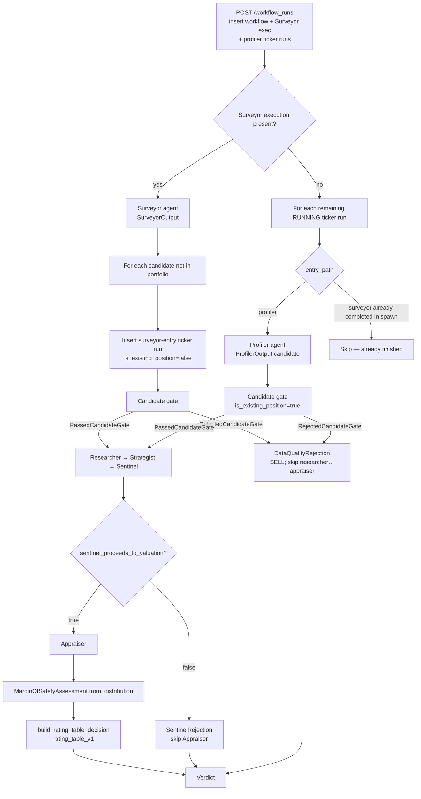

<!-- Synced: 2026-08-30 from live code via `.cursor/skills/sync-workflow` -->

# Discount Analyst — current workflow

Implementation-accurate snapshot of the agentic pipeline. Ground truth is the code. Field lists come from `model_json_schema()` / enum introspection unless a computed field is called out as class-only.

## Changes since last sync

Previous snapshot: 2026-08-28. Material change is **CODE-53**: official £0 regulatory-data tools (NASDAQ Trader / LSE listings, SEC companyfacts, Companies House iXBRL) are wired through `REGULATORY_TOOLSETS_BY_ROLE` in `agents/runtime/agent_factory.py`. Surveyor receives universe listing tools plus filing tools; Profiler, Researcher, Strategist, Sentinel, and Appraiser receive filing tools only. FMP/EODHD MCP screening is unchanged. Bulk cache refresh is `discount-analyst admin refresh-regulatory-data` (`--exchanges` / `--sec` / `--companies-house`; no flag means all three). Cache dir `REGULATORY_DATA_CACHE_DIR` (default `data/regulatory_data`). SEC refresh and live companyfacts gap-fill require `SEC__USER_AGENT`.

**Sentinel — no web/MCP/terminal.** `create_sentinel_agent(ai_models_config)` always passes `enable_web_research_tools=False`, `use_mcp_financial_data=False`, and `terminal=terminal_run_options(..., enabled=False)`. Dashboard Perplexity/MCP/terminal settings are not forwarded. Frankfurter `convert_currency` and official filing tools (`get_sec_company_facts`, `resolve_uk_company`, `get_companies_house_accounts`) remain. CLI `agent sentinel` does not accept `--perplexity` / `--no-mcp` / `--no-terminal`.

**Sentinel — `gap_kind` + derived verdict.** Each `QuestionAssessment` has required `gap_kind` (`none` \| `calendar` \| `never_disclosed` \| `contradicted`). After a live run, `finalise_sentinel_evaluation` (`agents/sentinel/derive_thesis_verdict.py`) overwrites `thesis_verdict` before persist. Reconstruct from SQLite does **not** re-derive. Question-count mismatch (`len(assessments) != len(thesis.evaluation_questions)`) raises `SentinelQuestionCountError` and the lane fails without persist. Mock Sentinel skips derive. New enum member: `Thesis unproven — do not proceed`. Alembic `0011_sentinel_gap_kind_appraiser_audit` adds `evaluation_question_assessments.gap_kind` (`NOT NULL`, default `'none'`).

Derivation order (`derive_thesis_verdict`): (1) any `Breaks thesis` with Medium/High → `BROKEN_DO_NOT_PROCEED`; (2) any `Weakens thesis` with `gap_kind` in `{none, never_disclosed, contradicted}` → `WEAKENED_DO_NOT_PROCEED`; (3) else if non-calendar assessments are non-empty and ≥ half are Low → `UNPROVEN_DO_NOT_PROCEED`; (4) else if any `calendar` gap → `INTACT_WITH_RESERVATIONS`; (5) else `INTACT_PROCEED_TO_VALUATION`. Low-confidence `Breaks thesis` falls through to (3), not broken. The valuation gate is unchanged in *shape*: proceed only on the two intact verdicts, and still block on red-flag `Serious concern`. Unproven and weakened skip Appraiser.

**Sentinel rejection text.** `build_sentinel_rejection` now appends `verdict_rationale` and a compact `gap_kind` tally when the thesis is outside the proceed set.

**Existing-position Sentinel prompt.** Dashboard/CLI `is_existing_position` is threaded into `create_user_prompt`. Existing-position wording: judge the live thesis on printed evidence; unreleased prints are reservations, not an exit. Derivation and the rating table are unchanged by the flag.

**Appraiser — required blend.** `ValuationMethodResult.value_per_share` and `weight_pct` are required (`gt=0` / `0–100`). Weights must sum to **100 ± 0.05**. `expected_intrinsic_value` must equal `sum(value_per_share * weight_pct / 100)` within `max(0.01, 0.5% of |blend|)`. Percentiles stay model-produced (monotonic; expected in [p10, p90]); p10/p90 are not rewritten from cross-checks. `ValuationMethod` drops `other`; adds `earnings_multiple` and `fcf_yield`. `AppraiserOutput` requires `shares_outstanding` (`gt=0`), `share_count_source` (`filing` \| `profile` \| `implied_from_market_cap`), `quoted_price_unit` (`major` \| `subunit`). Old Appraiser JSON without these fields **fails closed** on `AppraiserOutput` validation (one contract). Alembic 0011 adds the three audit columns on `appraiser_reports` as **nullable** (historical rows); reconstruct still validates the Pydantic model.

**Strategist questions.** `evaluation_questions` field description and prompts require questions answerable from the last reported period plus the last trading update; a future print must not be load-bearing. No new enum.

**Unchanged.** Candidate gate, `DataQualityRejection`, CLI skip of the candidate gate, mock skip of the candidate gate, rating table, agent package set.

Live agent packages under `discount_analyst/agents/`: **surveyor, profiler, researcher, strategist, sentinel, appraiser**. There is **no Arbiter agent**. Final ratings after a passing Sentinel gate come from a deterministic table (`rating_table_v1` in `discount_analyst.domain.decisions.rating_decision_table`).

Checked and recorded below: schemas, agents, gates/orchestration, ratings, tools/data. Prompt vs code conflicts are listed in [Findings](#findings-prompt-vs-code), not silently “corrected” in the narrative.

---

## Overview

Discount Analyst runs a **gated, per-ticker lane** after a universe-level Surveyor and/or named-ticker Profiler pass.

Two entry paths (`EntryPathDb` / `EntryPathApi`):

- **Profiler entry** — dashboard portfolio tickers, or CLI `--profiler-tickers`. Runs Profiler first. Dashboard sets `is_existing_position=True`.
- **Surveyor entry** — names discovered by Surveyor that are not already in the portfolio. No Profiler execution. Dashboard sets `is_existing_position=False`.

Shared downstream lane (both paths): **candidate gate → Researcher → Strategist → Sentinel → (optional) Appraiser → programmatic verdict**.

Two runners share the same agent factories and decision builders:

1. **Dashboard** — `DashboardPipelineRunner.execute_workflow` persists SQLite rows, conversations, and a `Verdict`. HTTP create is `POST` on the workflow-runs router.
2. **CLI** — `uv run discount-analyst workflow run` writes JSON artefacts under `backend/outputs/`. It does **not** run the FMP/EODHD candidate gate.

Ticker lanes are **serial** in both runners (`await` in a `for` loop). There is no pipeline-level `asyncio.gather` of lanes. Parallelism exists only *inside* an agent turn (the Surveyor prompt asks for parallel screener/MCP calls).

---

## Pipeline diagram

Dashboard control flow from `DashboardPipelineRunner.execute_workflow` (`sqlmodel_runner.py`) plus `SurveyorStage`, `ProfilerStage`, `CandidateGateStage`, and `TickerLaneStage`.



CLI omits the candidate-gate diamond: Surveyor or Profiler output goes straight to `SurveyorCandidate.to_lane_context()` and the same Researcher→… path (`run_full_workflow.py`).

---

## Agent handoff table

| Stage          | Stance (from that agent’s system prompt)                           | Input                                   | Output schema                                     | Tools                                                                                                                                                  |
| -------------- | ------------------------------------------------------------------ | --------------------------------------- | ------------------------------------------------- | ------------------------------------------------------------------------------------------------------------------------------------------------------ |
| Surveyor       | Disciplined **screener** in neglected small-caps                   | Open mandate (`USER_PROMPT`); no ticker | `SurveyorOutput` (`candidates` min 15)            | Web research + financial MCP + optional terminal + official universe lists + official filings                                                           |
| Profiler       | Financial screener of a **named** stock; resist favourable framing | Ticker string                           | `ProfilerOutput` wrapping one `SurveyorCandidate` | Same as Surveyor except no universe listing tools (filings only)                                                                                       |
| Candidate gate | Deterministic, not an LLM                                          | `SurveyorCandidate`                     | `PassedCandidateGate` / `RejectedCandidateGate`   | FMP (+ EODHD fallback for `.L`). Identity-unknown and listing-unconfirmed **admit**. DQR is **delist-only**. **Skipped in mock.** **Not used by CLI.** |
| Researcher     | **Neutral evidence assembler**; no recommendation language         | `SurveyorLaneContext`                   | `DeepResearchReport`                              | Web research + financial MCP + optional terminal + official filings                                                                                    |
| Strategist     | **Second-level thinker**; interpreter not researcher               | Lane context + `DeepResearchReport`     | `MispricingThesis`                                | Web research + financial MCP + optional terminal + official filings (factory still forwards dashboard flags; see Findings)                             |
| Sentinel       | **Adversary, not a validator**                                     | Lane context + research + thesis        | `EvaluationReport`                                | FX (`convert_currency`) + official filings. No web, MCP, or terminal. `thesis_verdict` overwritten in Python after a live run.                         |
| Appraiser      | Valuation specialist; **no Buy/Hold/Sell**                         | `AppraiserInput`                        | `AppraiserOutput`                                 | Web research + financial MCP + optional terminal + official filings                                                                                    |
| Rating table   | Deterministic                                                      | Lane + thesis + evaluation + MoS        | `RatingTableDecision` inside `Verdict`            | None                                                                                                                                                   |

Shared investing creed: `discount_analyst.agents.common_prompts.creed.INVESTING_CREED` (prepended or wrapped by every agent system prompt).

Structured output is always pydantic-ai **tool mode** (`ToolOutput` → `final_result`) via `create_agent` in `agents/runtime/agent_factory.py`.

---

## Rating system

Enum `InvestmentRating` (`domain/decisions/investment_rating.py`):

| Member        | Value         |
| ------------- | ------------- |
| `STRONG_BUY`  | `STRONG BUY`  |
| `BUY`         | `BUY`         |
| `HOLD`        | `HOLD`        |
| `SELL`        | `SELL`        |
| `STRONG_SELL` | `STRONG SELL` |

Persisted `decision_type` (`DecisionTypeDb` / `DecisionTypeApi`): `rating_table` | `sentinel_rejection` | `data_quality_rejection`.

### `is_existing_position`

Threaded from dashboard entry path (profiler = true, surveyor-discovered = false) or CLI `--is-existing-position`.

| Path                   | Rating                                                                        | Action text                                                                                                                                 |
| ---------------------- | ----------------------------------------------------------------------------- | ------------------------------------------------------------------------------------------------------------------------------------------- |
| Data-quality rejection | Always `SELL`                                                                 | Existing: “Exit the position; data quality gate failed.” New: “Do not initiate; data quality gate failed.” (`build_data_quality_rejection`) |
| Sentinel rejection     | `STRONG_SELL` if thesis broken **or** red-flag `Serious concern`; else `SELL` | Existing: “Exit immediately.” / “Exit the position.” New: “Avoid.” / “Do not initiate.” (`build_sentinel_rejection`)                        |
| Rating table           | **Not** a function of `is_existing_position`                                  | Action string **is** (`_recommended_action_for_rating_position`)                                                                            |

So the flag **frames recommended action** on the valuation path and on Sentinel/data-quality action wording. On live Sentinel it also injects existing-position prompt wording. It does **not** change derivation, the valuation-gate proceed set, or rating-table tiers.

### Sentinel valuation gate

After a **live** Sentinel run, `finalise_sentinel_evaluation(evaluation, thesis)` in `agents/sentinel/derive_thesis_verdict.py` (1) rejects a question-count mismatch with `SentinelQuestionCountError` (lane fails; nothing is persisted) and (2) overwrites `thesis_verdict` from `question_assessments` / `gap_kind`. The model’s submitted `thesis_verdict` is best-effort only. Reconstruct-from-DB and mock Sentinel do **not** re-run this.

`sentinel_proceeds_to_valuation(evaluation)` in `agents/sentinel/schema.py` then:

```text
False if overall_red_flag_verdict == "Serious concern"
else True iff thesis_verdict in {
  "Thesis intact — proceed to valuation",
  "Thesis intact with reservations — proceed with noted caveats",
}
```

`Thesis weakened — do not proceed` and `Thesis unproven — do not proceed` both skip Appraiser (SELL unless the red-flag screen is `Serious concern`, which is STRONG SELL).

On false: Appraiser execution is marked `skipped`; `SentinelRejection` is persisted (`rejection_reason` includes `verdict_rationale` and a `gap_kind` tally when the thesis is outside the proceed set). On true: Appraiser runs, then the table.

`INTACT_WITH_RESERVATIONS` **does** proceed. It later sets `sentinel_has_reservations=True` in the table, which blocks `STRONG BUY` (Substantial + High + no reservations is the only `STRONG BUY` cell).

### Margin of safety (from Appraiser distribution)

`MarginOfSafetyAssessment.from_distribution` uses `current_share_price`, `expected_intrinsic_value`, `p10`, `p90`.

`margin_of_safety_base_pct = (expected − price) / price × 100`, then:

| Bucket                                                                  | Condition |
| ----------------------------------------------------------------------- | --------- |
| Substantial — price implies significant downside in market expectations | `>= 40`   |
| Moderate — meaningful upside but not exceptional                        | `>= 20`   |
| Thin — limited margin for error                                         | `> 0`     |
| None — stock appears fairly valued or overvalued                        | otherwise |

Computed serialisation aliases on the class (not LLM fields): `intrinsic_value_base` / `_bear` / `_bull`, `margin_of_safety_base_pct`, `margin_of_safety_verdict`.

### Rating table (`rating_from_table_inputs`, `decision_rule_id="rating_table_v1"`)

Match on `(MoS bucket, Strategist conviction, sentinel_has_reservations)`:

| MoS         | Conviction            | Reservations | Rating       |
| ----------- | --------------------- | ------------ | ------------ |
| Substantial | High                  | false        | `STRONG BUY` |
| Substantial | any other combination |              | `BUY`        |
| Moderate    | High or Medium        | ignored      | `BUY`        |
| Moderate    | Low                   | ignored      | `HOLD`       |
| Thin        | ignored               | ignored      | `HOLD`       |
| None        | ignored               | ignored      | `SELL`       |

The table **never** emits `STRONG SELL`. That rating only appears on Sentinel rejection (broken thesis or serious red flag).

Recommended action by `(rating, is_existing_position)`:

| Rating      | New candidate                                            | Existing position                                                 |
| ----------- | -------------------------------------------------------- | ----------------------------------------------------------------- |
| STRONG BUY  | Initiate at full position (core sizing)                  | Add to position (scale toward target)                             |
| BUY         | Initiate at half or quarter position (starter)           | Hold; consider adding if position is underweight (add)            |
| HOLD        | Does not clear the bar — do not initiate (pass)          | Thesis intact; valuation roughly fair; continue holding (monitor) |
| SELL        | Stock is overvalued or thesis is broken — avoid (no new) | Exit the position (reduce)                                        |
| STRONG SELL | Serious concern; avoid (no new)                          | Exit immediately (urgent)                                         |

---

## Complete schema reference

Introspected 2026-08-28 via `model_json_schema()` / enum values. Nested models are listed once. `required` means the JSON schema `required` array (Pydantic defaults may still appear on the wire).

### Enums

| Enum                     | Values                                                                                                                                                                                                                                        |
| ------------------------ | --------------------------------------------------------------------------------------------------------------------------------------------------------------------------------------------------------------------------------------------- |
| `Exchange`               | `LSE`, `AIM`, `NYSE`, `NASDAQ`                                                                                                                                                                                                                |
| `Currency`               | `GBP`, `USD`                                                                                                                                                                                                                                  |
| `StockCategory`          | `value`, `growth` — **defined in `surveyor.schema` but unused** (no field on `SurveyorCandidate`)                                                                                                                                             |
| `ThesisVerdict`          | `Thesis intact — proceed to valuation`, `Thesis intact with reservations — proceed with noted caveats`, `Thesis weakened — do not proceed`, `Thesis unproven — do not proceed`, `Thesis broken — do not proceed`                              |
| `OverallRedFlagVerdict`  | `Clear`, `Monitor`, `Serious concern`                                                                                                                                                                                                         |
| `ValuationMethod`        | `dcf`, `reverse_dcf`, `comparable_multiples`, `sum_of_parts`, `asset_value`, `unit_economics`, `scenario_weighting`, `monte_carlo`, `earnings_multiple`, `fcf_yield` (no `other`)                                                              |
| `InvestmentRating`       | see [Rating system](#rating-system)                                                                                                                                                                                                           |
| `AgentName` (runtime)    | `APPRAISER`, `PROFILER`, `RESEARCHER`, `SENTINEL`, `STRATEGIST`, `SURVEYOR`                                                                                                                                                                   |
| `AgentNameDb` / API slug | lowercase: `surveyor`, `profiler`, `researcher`, `strategist`, `sentinel`, `appraiser`                                                                                                                                                        |
| `ModelName`              | `claude-opus-4-5`, `claude-sonnet-4-5`, `claude-opus-4-6`, `claude-sonnet-4-6`, `claude-haiku-4-6`, `gpt-5.1`, `gpt-5.2`, `gpt-5.4`, `gpt-5.6-luna`, `gemini-3-pro-preview`, `gemini-3.1-pro-preview`, `deepseek-v4-flash`, `deepseek-v4-pro` |

### `KeyMetrics`

All fields optional (`null` allowed). `piotroski_f_score`: integer 0–9 or null.

`trailing_pe`, `ev_ebit`, `price_to_book`, `revenue_growth_3y_cagr_pct`, `free_cash_flow_yield_pct`, `net_debt_to_ebitda`, `piotroski_f_score`, `altman_z_score`, `insider_buying_last_6m`.

### `SurveyorCandidate` (required unless noted)

`ticker`, `company_name`, `exchange`, `currency`, `market_cap_local` (int), `market_cap_display`, `sector`, `industry`, `key_metrics`, `rationale`, `red_flags`, `data_gaps`. Optional: `analyst_coverage_count` (int \| null).

`to_lane_context(resolved_ticker=…)` drops `market_cap_*` and `key_metrics`.

### `SurveyorLaneContext` (all required)

`ticker`, `company_name`, `exchange`, `currency`, `sector`, `industry`, `analyst_coverage_count` (int \| null), `rationale`, `red_flags`, `data_gaps`.

### `SurveyorOutput`

`candidates`: array of `SurveyorCandidate`, **`minItems`: 15**, unique tickers (validator).

### `ProfilerOutput`

`candidate`: `SurveyorCandidate` (required).

### `DeepResearchReport` (all required)

| Field                   | Type                                                                                                                                                                                                                 |
| ----------------------- | -------------------------------------------------------------------------------------------------------------------------------------------------------------------------------------------------------------------- |
| `executive_overview`    | string                                                                                                                                                                                                               |
| `business_model`        | `BusinessModel`: `products_and_services`, `customer_segments`, `unit_economics`, `competitive_positioning`, `moat_and_durability`                                                                                    |
| `financial_profile`     | `FinancialProfile`: `key_metrics_updated` (`KeyMetrics`), `revenue_and_growth_quality`, `profitability_and_margin_structure`, `balance_sheet_and_liquidity`, `cash_flow_and_capital_intensity`, `capital_allocation` |
| `management_assessment` | `ManagementAssessment`: `leadership_and_execution`, `governance_and_alignment`, `communication_quality`, `key_concerns`                                                                                              |
| `market_narrative`      | `MarketNarrative`: `dominant_narrative`, `bull_case_in_market`, `bear_case_in_market`, `expectations_implied_by_price`, `where_expectations_may_be_wrong`, `narrative_monitoring_signals` (string[])                 |
| `risks`                 | string[]                                                                                                                                                                                                             |
| `potential_catalysts`   | string[]                                                                                                                                                                                                             |
| `data_gaps_update`      | `DataGapsUpdate`: `original_data_gaps`, `closed_gaps`, `remaining_open_gaps`, `material_open_gaps`                                                                                                                   |
| `source_notes`          | string[]                                                                                                                                                                                                             |

No `minItems` on the lists.

### `MispricingThesis` (all required)

`ticker`, `company_name`, `mispricing_type`, `market_belief`, `mispricing_argument`, `resolution_mechanism`, `falsification_conditions` (string[]), `thesis_risks` (string[]), `evaluation_questions` (string[]), `permanent_loss_scenarios` (string[]), `conviction_level` (`Low` \| `Medium` \| `High`).

`evaluation_questions` description: each question must be answerable from the last reported period plus the last trading update; a future print (e.g. “what will FY26 report?”) must not be load-bearing. Descriptions say “minimum 3 / 5 / 2” for some lists; **JSON schema has no `minItems`** on those arrays.

### `EvaluationReport` (all required)

`ticker`, `company_name`, `question_assessments` (`QuestionAssessment`[]), `red_flag_screen` (`RedFlagScreen`), `thesis_verdict`, `verdict_rationale`, `material_data_gaps`, `caveats` (string[]).

`QuestionAssessment`: `question`, `evidence`, `verdict` (`Supports thesis` \| `Neutral` \| `Weakens thesis` \| `Breaks thesis`), `confidence` (`Low` \| `Medium` \| `High`), `gap_kind` (`none` \| `calendar` \| `never_disclosed` \| `contradicted`).

`RedFlagScreen`: `governance_concerns`, `balance_sheet_stress`, `customer_or_supplier_concentration`, `accounting_quality`, `related_party_transactions`, `litigation_or_regulatory_risk`, `overall_red_flag_verdict`.

No persisted `recommendation` field. The model fills `thesis_verdict` best-effort; live runners overwrite it via `finalise_sentinel_evaluation` before persist. The valuation gate is then `sentinel_proceeds_to_valuation`.

### `AppraiserInput` (all required)

`lane_context`, `deep_research`, `thesis`, `evaluation`, `risk_free_rate_pct` (float; caller-supplied).

### `IntrinsicValueDistribution` (all required)

`currency` (string length 3–8), `current_share_price` (>0), `expected_intrinsic_value` (>0), `p10`/`p25`/`p50`/`p75`/`p90_intrinsic_value` (>0), `distribution_method`, `distribution_reasoning`.

Class validator: percentiles monotonic; expected between p10 and p90.

### `ValuationMethodResult`

Required: `method`, `role` (`primary` \| `cross_check`), `value_per_share` (`gt=0`), `weight_pct` (`0–100`). Optional: `low_value_per_share`, `high_value_per_share` (both `gt=0` or null). Default empty lists: `key_assumptions`, `evidence_summary`, `sanity_checks`, `limitations`.

Low ≤ high when both present.

### `AppraiserOutput`

Required: `ticker`, `company_name`, `valuation_date`, `summary`, `valuation_distribution`, `methods`, `data_quality` (`High` \| `Medium` \| `Low`), `shares_outstanding` (`gt=0`), `share_count_source` (`filing` \| `profile` \| `implied_from_market_cap`), `quoted_price_unit` (`major` \| `subunit`).

Default empty lists: `key_value_drivers`, `downside_risks_to_value`, `upside_drivers_to_value`, `caveats`.

Class validator: ≥1 method; **exactly one** `primary`; **≥1** `cross_check`; weights sum to **100 ± 0.05**; `expected_intrinsic_value` equals the weight-blend of method `value_per_share` values within `max(0.01, 0.5% of |blend|)`. Distribution percentiles remain a separate monotonic / expected-in-[p10, p90] check.

### Gate result models

`PassedCandidateGate`: `gate_status="passed"`, `source_ticker`, `resolved_ticker`, `resolution_notes`, `is_actively_trading` (`True` means **not proven delisted**, including unconfirmed listing), `data_source` (`fmp` \| `eodhd` \| `mock`), `lane_context`.

`RejectedCandidateGate`: `gate_status="rejected"`, `source_ticker`, `resolved_ticker` (nullable), `resolution_notes`, `gate_failure_reason`, `is_actively_trading` (nullable), `data_source`.

### Decision models

`DataQualityRejection`: rating **const `SELL`**, plus ticker/company/date/position/action/`rejection_reason`.

`SentinelRejection`: rating `SELL` \| `STRONG SELL`, plus the same identity fields and `rejection_reason`.

`RatingTableRationale`: required `primary_driver`, `red_flag_disposition`, `data_gap_disposition`; `supporting_factors` / `mitigating_factors` default `[]`.

`RatingTableDecision`: `decision_rule_id` const `rating_table_v1`, identity fields, `rating`, `recommended_action`, `conviction`, `margin_of_safety`, `rationale`, `thesis_expiry_note`.

`Verdict`: identity + `rating` + `recommended_action` + `decision` (union of the three decision types).

`MarginOfSafetyAssessment` input fields: `current_price`, `expected_intrinsic_value` (aliases `intrinsic_value_base` / `base_intrinsic_value`), `p10_intrinsic_value`, `p90_intrinsic_value` (all >0).

---

## Per-stage notes

### Workflow create (dashboard)

`create_workflow_run` in `entrypoints/api/routers/workflow_runs.py`:

- Inserts `workflow_runs` with `portfolio_tickers` and `is_mock`.
- **If `settings.deploy_env == "DEV"`, `is_mock` is forced `True`**, ignoring the request body.
- Always inserts a workflow-level Surveyor execution (`surveyor_started=True`).
- Each non-empty portfolio ticker becomes a profiler-entry run with `PROFILER_ENTRY_AGENT_NAMES` and `is_existing_position=True`.
- Schedules `DashboardPipelineRunner.schedule_workflow_execution`.

Also: cancel; `retry_failed_agents` (resets failed or cancelled lane executions from the first unfinished agent onward, then re-enters `execute_workflow`; completed stages and completed lanes are skipped by status checks).

### Surveyor

Factory: `create_surveyor_agent` → `SurveyorOutput`. Bound schema matches the prompt’s `<output_schema>` embed of `SurveyorOutput.model_json_schema()`.

Hard filters in the prompt: market cap below £500M / $600M; LSE/AIM/NYSE/NASDAQ; liquidity; SEC or UK filings; ≥3 years history. Soft ranking signals for coverage gap, value, growth, earnings quality, balance sheet.

Dashboard: Surveyor discoveries whose ticker is already in the portfolio (casefold) are **not** spawned. Spawned lanes run **immediately** inside `SurveyorStage.run` via `spawn_surveyor_discovered_run`, then `execute_workflow` walks remaining RUNNING runs (profiler entries).

Mock: `mock_surveyor_dashboard_discoveries(..., limit=3)` — three names, so **mock output would not satisfy `minItems: 15`** if it went through `SurveyorOutput` validation; the dashboard mock path uses the helper’s candidate list, not a validated 15-row `SurveyorOutput`.

### Profiler

Factory: `create_profiler_agent` with `enable_web_research_tools=True`. Output is one `SurveyorCandidate` (same shape as a Surveyor row). Company name is written back onto the ticker run. Filing tools are attached; universe listing tools are not.

No `profiler/AGENTS.md`. Runtime `AgentName.PROFILER` exists; `agents/AGENTS.md` now lists `tools/`, `runtime/`, and `common_prompts/` but still omits Profiler.

### Candidate gate

`validate_candidate` (`adapters/market_data/candidate_gates.py`):

1. **Ticker resolution** via FMP profile then symbol search (`_resolve_ticker` / `_resolve_via_search`). Auto-correct only when FMP is confident: profile company-name similarity ≥ 0.55, or search exact `symbol` + exchange match, or exactly one strong name match (≥ 0.75) on the candidate’s exchange (exchange aliases in `_EXCHANGE_FMP_ALIASES`). Unknown or ambiguous identity — empty search, weak name hits, several strong matches, FMP 402/403 on profile or search — **admits the original ticker** (`resolved_ticker == source_ticker`); `resolution_notes` records why identity was left unchanged. Identity never returns `RejectedCandidateGate`.
2. **Listing probe** (`_check_listing_status` / `_check_listing_via_eodhd`). Reject only on **positive** dead-listing evidence:
   - Non-`.L`: FMP `isActivelyTrading is false` (no EODHD override).
   - `.L`: FMP inactive/missing/denied still falls through to EODHD unless `eodhd.disabled`; reject only if EODHD `IsDelisted is true`.
   Unconfirmed listing **admits**: no FMP profile, `isActivelyTrading` unknown, FMP listing probe 402/403, EODHD missing quote **and** missing fundamentals, EODHD `close` NA/None but not delisted, EODHD HTTP 403/5xx or `httpx` transport errors on the listing probe (caught at the gate; client 404 already returns `None` without raising). Notes must say listing was unconfirmed. `is_actively_trading` is `True` meaning not proven delisted.

Pass: `lane_context` with `resolved_ticker`; ticker run updated if the symbol changed (`CandidateGateStage._apply_resolved_ticker`). Fail: skip Researcher–Appraiser; persist `DataQualityRejection` (delist-only). `validate_candidate` is the only composer of `PassedCandidateGate` / `RejectedCandidateGate` (from `TickerResolution` plus `ListingProbe` or `ListingDelisted`). `is_actively_trading` is set at compose time (`True` on pass, `False` on reject).

Mock: always `PassedCandidateGate` with notes `"Mock run: gate skipped."`

CLI: **no gate** (`run_full_workflow.py` uses `SurveyorCandidate.to_lane_context()` directly).

### Researcher / Strategist / Sentinel

Serial. User prompts inject `<SurveyorLaneContext>` plus the quantitative-omission note (`lane_context_prompt.py`): screening metrics are not trusted numbers.

Researcher and Appraiser get Perplexity/MCP/terminal flags from settings. Strategist factory still forwards those same flags (`use_mcp_financial_data=True` default; `enable_web_research_tools` left at `create_agent` default `True`). Sentinel has no web/MCP/terminal: `create_sentinel_agent(ai_cfg)` only; live path uses `run_streamed_agent` with terminal disabled, then `finalise_sentinel_evaluation` before persist. Official filing tools are attached for all of these stages. Dashboard `is_existing_position` is passed into the Sentinel user prompt.

### Appraiser

`AppraiserInput` is built in `TickerLaneStage.run_appraiser_final_rating` with `risk_free_rate_pct=host.settings.risk_free_rate_pct` (dashboard default 3.7, env `DASHBOARD_RISK_FREE_RATE`; CLI requires `--risk-free-rate`).

DCF is **a valid method, not a required stage**. Optional Python helpers live under `discount_analyst/domain/valuation/toolkit/` (`dcf.py`, `reverse_dcf.py`, `multiples.py`, …) and `domain/valuation/schema.py` (`StockData`, `StockAssumptions`). The Appraiser user prompt says **do not** return those DCF-specific objects. There is no separate deterministic DCF engine invoked by the runner; arithmetic is LLM + optional terminal.

On Appraiser success the runner does **not** call an LLM “final decision agent”; it builds MoS and `build_rating_table_decision`.

If Appraiser execution id is missing, `run_appraiser_final_rating` **returns without a verdict** (`if appraiser_exec_id is None: return`). That is a short-circuit distinct from skip-on-Sentinel-fail.

### Mock mode

Triggered by workflow `is_mock` (dashboard DEV always). `pipeline_llm_config(..., is_mock=True)` yields `ai_models_config=None`, `model_name=None`. Each mock agent sleeps 5s and uses `adapters.simulation.mock_outputs`. Mock Sentinel proceed is **deterministic ticker char-sum parity** (`mock_sentinel_proceed_for_dashboard_lane`). Mock rating uses `mock_rating_table_decision` rather than live MoS from a distribution.

A completed dashboard run with `is_mock=true` did **not** hit live LLM/MCP/FMP for those stages.

---

## Tools, models, and data

Configuration: `discount_analyst.config.settings.Settings` (root / package `.env`, nested `ENV__` keys).

| Setting                                                       | Default (code) | Role                                                                                                                  |
| ------------------------------------------------------------- | -------------- | --------------------------------------------------------------------------------------------------------------------- |
| `default_model` / `DASHBOARD_DEFAULT_MODEL`                   | `gpt-5.6-luna` | All dashboard pipeline agents via `AIModelsConfig(model_name=settings.default_model)` — **one model for every stage** |
| `use_perplexity` / `DASHBOARD_USE_PERPLEXITY`                 | `False`        | Perplexity `web_search` + `sec_filings_search` instead of pydantic-ai WebSearch/WebFetch                              |
| `use_mcp_financial_data` / `DASHBOARD_USE_MCP_FINANCIAL_DATA` | `True`         | EODHD + FMP MCP toolsets                                                                                              |
| `use_terminal` / `DASHBOARD_USE_TERMINAL`                     | `True`         | Docker-backed `terminal_exec` via `TERMINAL_SERVICE_URL`                                                              |
| `eodhd.disabled` / `EODHD__DISABLED`                          | `False`        | Omits EODHD MCP (and EODHD listing fallback)                                                                          |
| `risk_free_rate_pct`                                          | `3.7`          | Injected into Appraiser user prompt                                                                                   |
| `regulatory_data_cache_dir` / `REGULATORY_DATA_CACHE_DIR`     | `data/regulatory_data` | Official NASDAQ/LSE/SEC/Companies House cache (gitignored)                                                            |
| `sec_user_agent` / `SEC__USER_AGENT`                          | `""`           | Required for SEC bulk refresh and live companyfacts gap-fill; not required for listings or Companies House            |

MCP (`agents/tools/market_data/financial_data_mcp.py`): `https://mcp.eodhd.dev/mcp`, `https://financialmodelingprep.com/mcp`. Providers that support MCP: Anthropic, OpenAI, DeepSeek (`provider_features.py`). Google is **not** in that set — enabling MCP with a Google model raises `NotImplementedError`.

FMP blacklist (`mcp_tool_blacklist.py`): blocked tools `analyst`, `news`, `insiderTrades`, `chart`, `calendar`; blocked `statements` endpoints include `financial-scores` / `financial-score`, full statements, key-metrics, TTM statements, segments, owner-earnings; also `company`/`batch-market-cap` and `quote`/`quote-short`. EODHD blacklist is empty. Calls are wrapped in `InfallibleToolset` so 402s become model-visible errors.

When Perplexity is off: `WebSearch(native=True, local=bounded DuckDuckGo)` and `WebFetch` (DeepSeek uses text-only local fetch). When Perplexity is on: `create_perplexity_toolset(agent_name)` — descriptions in `agents/runtime/tool_descriptions.py` (Appraiser, Profiler, Surveyor, Researcher). Sentinel has no Perplexity entry because those tools are not registered. Strategist *can* receive Perplexity when `use_perplexity=True` (dashboard setting / CLI `--perplexity`).

Web-research agents: Surveyor, Profiler, Researcher, Appraiser, and **Strategist** (factory default). Sentinel: no web, MCP, or terminal; FX plus official filing tools.

Official regulatory-data tools (`agents/tools/regulatory_data/`): `list_us_listed_equities` / `list_uk_listed_equities` (Surveyor only) and `get_sec_company_facts` / `resolve_uk_company` / `get_companies_house_accounts` (all pipeline agents, including Sentinel). Responses paginate at 50 (cap 100). Operator refresh: `discount-analyst admin refresh-regulatory-data`. These tools do not replace FMP/EODHD MCP screeners.

---

## Data flow summary

```text
Create workflow
  ├─ Surveyor → SurveyorOutput.candidates
  │     └─ not in portfolio → snapshot + surveyor-entry Run
  └─ portfolio tickers → profiler-entry Run
                              └─ ProfilerOutput.candidate  (= SurveyorCandidate)

SurveyorCandidate
  └─ gate → SurveyorLaneContext (identity + narrative; no market cap / key_metrics)
        └─ Researcher → DeepResearchReport
              └─ Strategist → MispricingThesis
                    └─ Sentinel → EvaluationReport
                          ├─ gate fail → SentinelRejection → Verdict
                          └─ gate pass → AppraiserInput
                                └─ AppraiserOutput.valuation_distribution
                                      └─ MarginOfSafetyAssessment
                                            └─ RatingTableDecision → Verdict
```

Dashboard persists agent `output_json`, conversations, candidate-snapshot gate columns, and `final_verdict_json` on the ticker run.

---

## Design principles (as implemented)

- **Separation of stances**: screen → profile/evidence → thesis → adversarial gate → valuation-only → deterministic rating. No single agent both values and rates.
- **Lane context strips trusted screening numbers** so Researcher/Strategist/Sentinel/Appraiser must re-source quantities.
- **Gates are code, not prompt**: listing/ticker (`validate_candidate`), Sentinel thesis verdict (`derive_thesis_verdict` / `finalise_sentinel_evaluation`), valuation proceed (`sentinel_proceeds_to_valuation`), Appraiser expected-value identity (weight-blend validator), rating (`rating_from_table_inputs`).
- **One dashboard model** for all stages; CLI can pick `--model` per run.
- **Mock is a first-class path** and, in DEV, the only dashboard path.

---

## Where to look in the repo

| What                                           | Where                                                                                                              |
| ---------------------------------------------- | ------------------------------------------------------------------------------------------------------------------ |
| Dashboard runner                               | `backend/src/discount_analyst/adapters/orchestration/sqlmodel_runner.py`                                           |
| Stages                                         | `.../adapters/orchestration/stages/{surveyor,profiler,candidate_gate,ticker_lane}_stage.py`                        |
| Lane order                                     | `application/workflows/agent_lane_order.py` (mirrored in `frontend/src/features/pipeline-graph/agentLaneOrder.ts`) |
| HTTP create/cancel/retry                       | `entrypoints/api/routers/workflow_runs.py`                                                                         |
| CLI workflow                                   | `entrypoints/cli/workflows/run_full_workflow.py`                                                                   |
| Decision builders                              | `application/decisions/builders.py`                                                                                |
| Rating table                                   | `domain/decisions/rating_decision_table.py`                                                                        |
| Verdict schemas                                | `domain/decisions/schema.py`                                                                                       |
| Agent factories / prompts / schemas            | `agents/<name>/`                                                                                                   |
| Sentinel thesis-verdict derivation             | `agents/sentinel/derive_thesis_verdict.py`                                                                         |
| Shared agent runtime                           | `agents/runtime/` (`create_agent`, streaming, terminal bind)                                                       |
| MCP + blacklist                                | `agents/tools/market_data/`                                                                                        |
| Official listings + filings                    | `agents/tools/regulatory_data/` (`toolsets.py`, `exchanges/`, `sec_edgar/`, `companies_house/`)                    |
| Regulatory cache refresh                       | `backend/tools/refresh_regulatory_data.py` (`discount-analyst admin refresh-regulatory-data`)                      |
| Candidate gate                                 | `adapters/market_data/candidate_gates.py`                                                                          |
| Mock payloads                                  | `adapters/simulation/mock_outputs.py`                                                                              |
| Settings                                       | `config/settings.py`                                                                                               |
| Alembic (gap_kind + Appraiser audit columns)   | `backend/migrations/versions/0011_sentinel_gap_kind_appraiser_audit.py`                                            |
| Valuation toolkit (optional Appraiser helpers) | `domain/valuation/toolkit/`                                                                                        |

CLI one-shots: `uv run discount-analyst agent {surveyor,profiler,researcher,strategist,sentinel,appraiser}`. Admin: `uv run discount-analyst admin refresh-regulatory-data`.

---

## Findings: prompt vs code

These are disagreements to resolve in code, prompts, or docs — not silently normalised here.

1. **Surveyor list length.** System prompt: “If you can only find 10 stocks… return 10.” Schema: `candidates` **`minItems`: 15**. User prompt Step 2 says “pull financial scores for your shortlist”; system prompt Step 2 says pull **profiles and fundamentals** (and notes Piotroski/Altman are typically unavailable on the FMP plan).
2. **Blacklisted FMP vs schema copy.** `KeyMetrics` field descriptions tell the model to use FMP Financial Score and insider-trading tools; those tools/endpoints are **plan-gated off**. Surveyor prompt is closer to reality (“pre-computed Piotroski and Altman are not available on the current FMP plan”).
3. **Beneish M-Score.** Surveyor prompt says it is “computed deterministically elsewhere”. **No Beneish implementation exists** in this package (grep only hits the prompt).
4. **`StockCategory`.** Enum `value`/`growth` is unused. Appraiser user prompt explicitly says not to label value vs growth. Root `AGENTS.md` still describes a manual “categorise value or growth” stage.
5. **Stale agent names in schemas/prompts.** Strategist `evaluation_questions` description still says “the Evaluation Agent”. Sentinel `caveats`: “Appraiser and **final decision agent**”. `sentinel_proceeds_to_valuation` docstring: “Appraiser / **DCF** stage”. There is no Evaluation/Arbiter/final-decision LLM; DCF is optional inside Appraiser.
6. **Researcher input type.** User prompt and factories pass `SurveyorLaneContext`. Researcher `DeepResearchReport` / `DataGapsUpdate` descriptions still say “Surveyor candidate”. System prompt Step 0 refers to `SurveyorCandidate.exchange` (the field exists on lane context too).
7. **CLI vs dashboard gates.** CLI full workflow never calls `validate_candidate`. Dashboard always does (except mock). Same agent chain, different admission policy.
8. **`agents/AGENTS.md`** omits Profiler; **no `profiler/AGENTS.md`**. Import paths in that file still mention `agents.common` and `scripts/agents`.
9. **Root `AGENTS.md` Investment Workflow** still describes a seven-stage partly-manual process (shortlist, categorise, external evaluate). The dashboard/CLI implement the automated lane above, with a human decision only after the `Verdict`.
10. **Strategist stance vs factory.** System prompt: interpreter, not researcher. `create_strategist_agent` still defaults `use_mcp_financial_data=True` and does not pass `enable_web_research_tools=False`, so dashboard Strategist still gets web/MCP/terminal from settings. Sentinel is the only production factory without web/MCP/terminal; it now also has official filing tools.

---

## Not verified at runtime

- Whether a given `.env` actually has Perplexity/FMP/EODHD keys, or `ENV=PROD` vs `DEV` — code paths are as above; live behaviour depends on the process environment.
- True MCP tool lists returned by FMP/EODHD servers (blacklist is local; remaining tools are whatever those servers advertise).
- Provider-native WebSearch/WebFetch quality for each `ModelName`.
